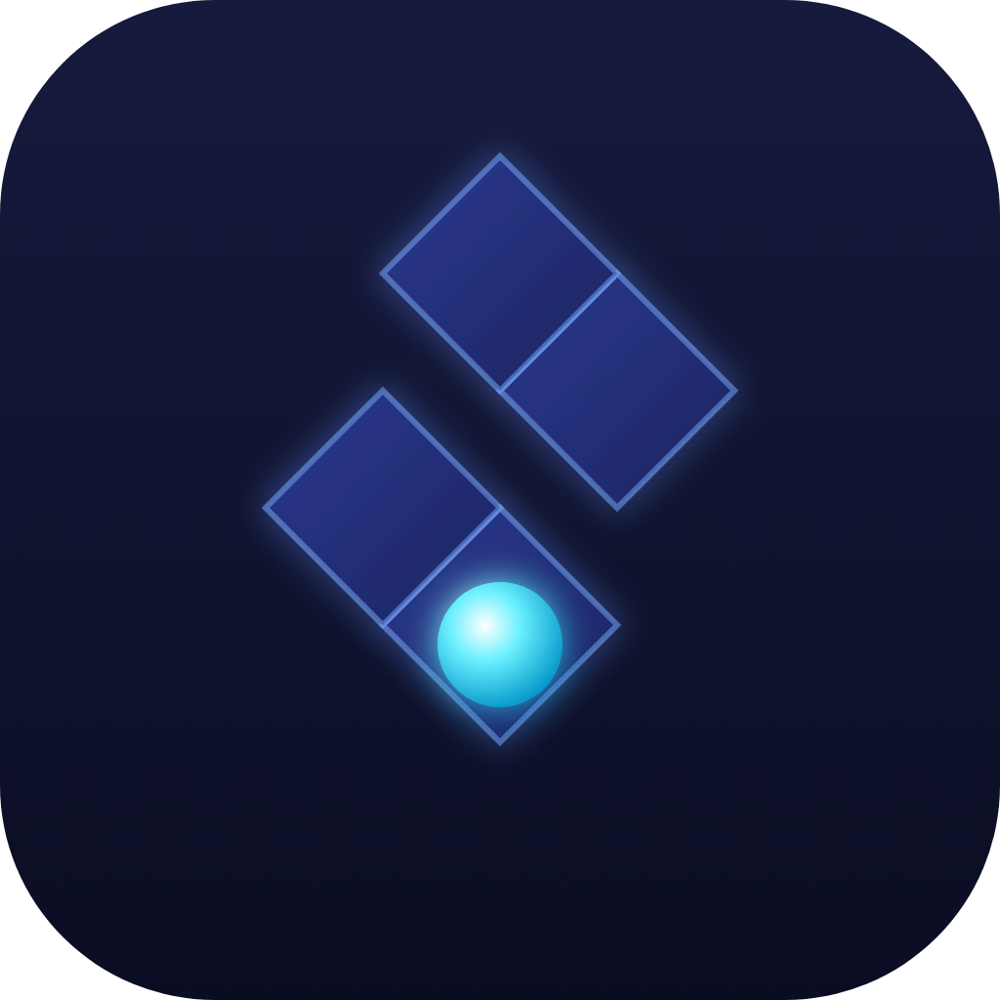

# 🎮 Neon Zigzag

Un juego móvil **hiper-casual** tipo arcade: un solo toque para cambiar la
dirección de la bola, sigue la pista en zigzag y no te caigas. Pensado para ser
**adictivo** (partidas de segundos, "una más", récords, combos) y **listo para
publicar** en Google Play y la App Store, con **monetización por anuncios**
(AdMob) ya integrada.



---

## ✨ Qué incluye

- **Juego completo y pulido** en HTML5 Canvas + JavaScript puro (sin dependencias):
  - Generación de pista infinita con dificultad creciente (la velocidad sube y
    los tramos se acortan según la puntuación).
  - "Juice" para enganchar: partículas, screen-shake, estela de la bola, popups
    de puntos, combos al encadenar gemas, sonido sintetizado (WebAudio).
  - Récord guardado en el dispositivo (`localStorage`), botón de silenciar.
- **Monetización lista** (`www/ads.js`):
  - **Intersticial** cada 2ª partida perdida.
  - **Recompensado** ("Continuar" tras morir, 1 vez por partida).
  - Funciona en web con un **anuncio simulado** para probar el flujo sin SDK.
- **Empaquetado para tiendas** con [Capacitor](https://capacitorjs.com)
  (Android + iOS) ya configurado.
- **Ícono de app** 1024×1024 (`assets/icon-1024.png`) y fuente SVG editable.

## 📁 Estructura

```
TestGoal/
├─ www/                 # el juego (esto es lo que se empaqueta)
│  ├─ index.html
│  ├─ styles.css
│  ├─ game.js           # motor del juego
│  ├─ ads.js            # wrapper de AdMob (+ fallback web)
│  └─ icon.svg
├─ assets/
│  ├─ icon.svg          # ícono fuente
│  └─ icon-1024.png     # ícono renderizado para las tiendas
├─ capacitor.config.json
├─ package.json
└─ README.md
```

---

## ▶️ Probarlo ahora (en el navegador)

```bash
# desde la carpeta del proyecto
npx --yes serve www -l 5000
# o, si tienes Python:
#   cd www && py -m http.server 5000
```

Abre `http://localhost:5000`. Toca/clic o barra espaciadora para cambiar de
dirección. En el navegador los anuncios se muestran **simulados**.

---

## 📦 Compilar para las tiendas (Capacitor)

Requisitos: Node 18+, y para compilar nativo **Android Studio** (Android) y/o
**Xcode** en macOS (iOS).

```bash
npm install

# Android
npx cap add android
npx cap sync android
npx cap open android      # abre Android Studio -> Build / Run / generar AAB

# iOS (solo en macOS)
npx cap add ios
npx cap sync ios
npx cap open ios          # abre Xcode -> Archive / subir a App Store Connect
```

Cada vez que cambies algo en `www/`, ejecuta `npx cap sync` antes de volver a
compilar.

---

## 💰 Monetización (AdMob) — pasos para producción

El juego ya trae integrado el plugin
[`@capacitor-community/admob`](https://github.com/capacitor-community/admob) y,
mientras pruebas, usa los **IDs de prueba oficiales de Google** (seguros de
publicar durante el desarrollo). Para cobrar de verdad:

1. Crea una cuenta en [AdMob](https://admob.google.com) y registra la app
   (Android e iOS son apps distintas).
2. Crea 2 bloques de anuncios por plataforma: **Intersticial** y **Recompensado**.
3. Pon tus IDs reales en `www/ads.js` dentro de `CONFIG.prod` y cambia
   `useTestAds` a `false`.
4. Pon el **App ID** de AdMob en `capacitor.config.json` (campo
   `plugins.AdMob.appId`) — ya está con el de prueba.
5. Android: el plugin añade el App ID al `AndroidManifest`. iOS: añade
   `GADApplicationIdentifier` en `Info.plist` (ver docs del plugin) y la cadena
   de **App Tracking Transparency** (`NSUserTrackingUsageDescription`).

> ⚠️ Nunca hagas clic en tus propios anuncios reales: AdMob banea cuentas por
> "clics inválidos". Usa siempre los IDs de prueba mientras desarrollas.

### Ideas para subir ingresos
- Un **banner** fijo abajo en el menú (no durante el juego, para no molestar).
- Más sitios de **recompensado** opcionales (duplicar monedas, revivir, skins).
- Si añades compras: **quitar anuncios** por un pago único es el IAP estrella en
  hiper-casual.

---

## ✅ Checklist de publicación

**Google Play**
- [ ] Cuenta de Google Play Console (pago único de 25 USD).
- [ ] Generar **AAB** firmado desde Android Studio.
- [ ] Ícono 512×512, capturas (mín. 2), gráfico destacado 1024×500.
- [ ] Política de privacidad (obligatoria por usar AdMob/identificadores).
- [ ] Cuestionario de clasificación de contenido y "Data safety".

**App Store (iOS)**
- [ ] Apple Developer Program (99 USD/año).
- [ ] Subir build con Xcode → App Store Connect.
- [ ] Ícono 1024×1024 (incluido), capturas por tamaño de dispositivo.
- [ ] Política de privacidad + "App Privacy" + texto de ATT.

---

## 🎚️ Ajustes rápidos del juego (en `www/game.js`)

| Qué | Variable / función |
|-----|--------------------|
| Velocidad inicial / máxima | `speedTiles` en `resetGame()` y `update()` |
| Dificultad (largo de tramos) | `segLenForScore()` |
| Frecuencia de gemas | probabilidad en `generateSegment()` |
| Cadencia de intersticiales | `deaths % 2` en `showGameOver()` |
| Colores neón | variables CSS en `styles.css` (`:root`) |

---

Hecho con Canvas, sin frameworks. Ligero, rápido y fácil de modificar. ¡A por
ese top de descargas! 🚀
